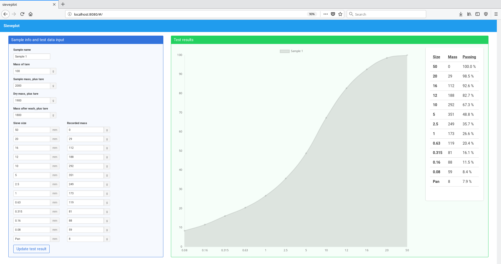

# sieveplot

> A geotechnical lab tool for particle size analysis.



**Note: Work in progress!**
Not all basic functionality implemented yet.

For more background information, see Wikipedia page on [Sieve analysis](https://en.wikipedia.org/wiki/Sieve_analysis)

Current version:
* accepts input for particle size analysis results (sample and sieve weights).
* sends inputted test data into the app's vuex store
* output pane grabs data object from store and plots the test result.
* ***note***: vuex may be overkill but future plans include working with larger sets of data (e.g. previously entered test results)

Next version:
* ~~Output pane gets data from input pane through vuex~~ done
* Support for storing multiple tests and viewing results later
* ~~Graph percent passing with chart.js~~ done
* Compare total recorded masses (from each sieve) to total sample weight to determine test error

## Frameworks/dependencies
Made with Vue.JS, vuex, Bulma, chart.js and vue-chartjs (a wrapper for using chart.js in Vue)

## Installing dev server

``` bash
# install dependencies
npm install

# serve with hot reload at localhost:8080
npm run dev

# run all tests
npm test
```
